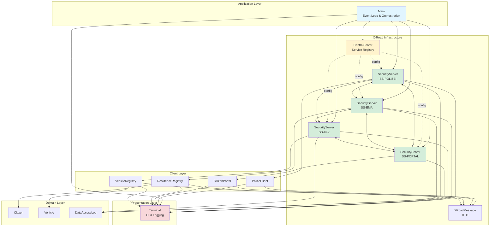
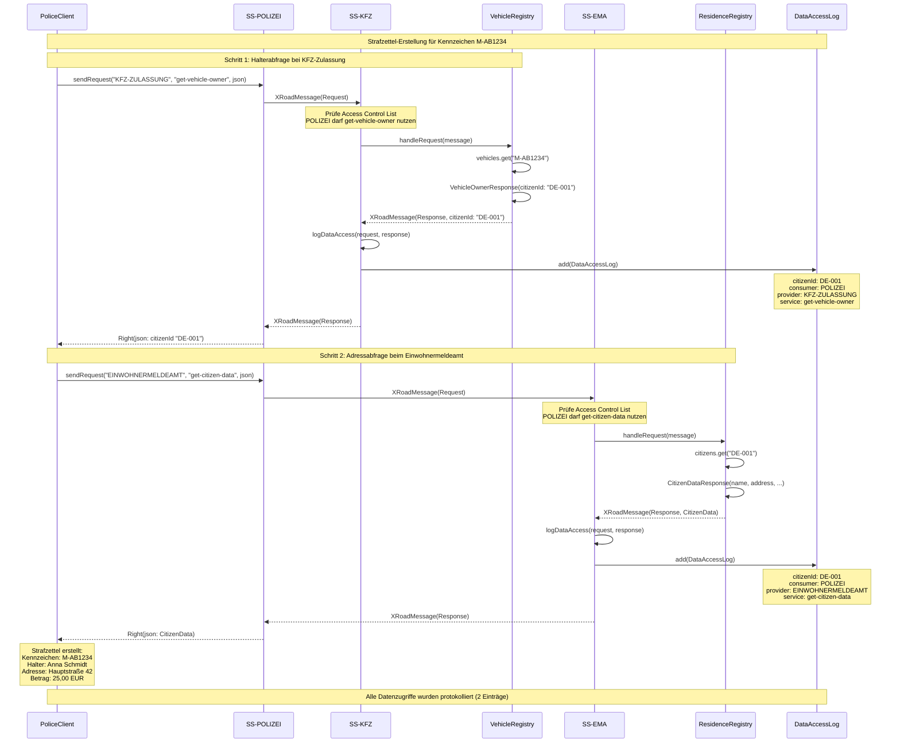
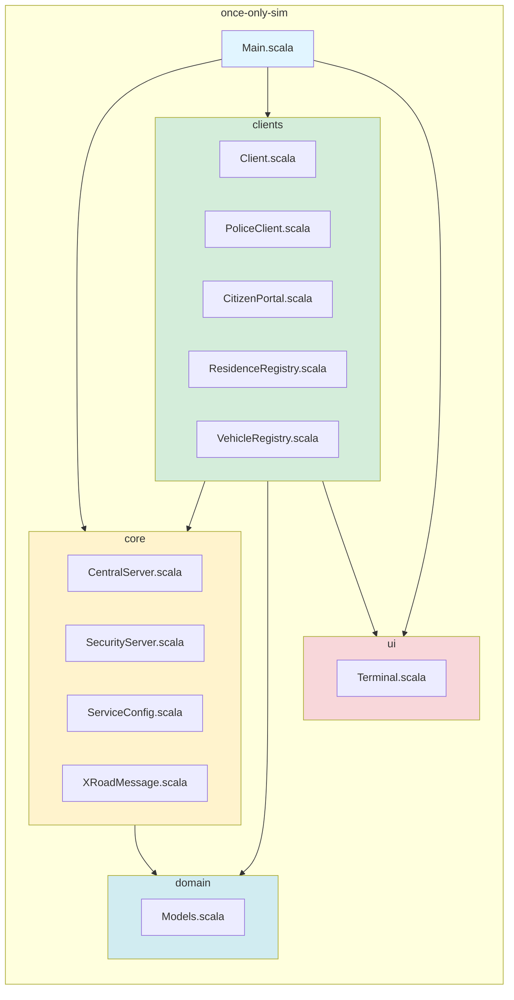
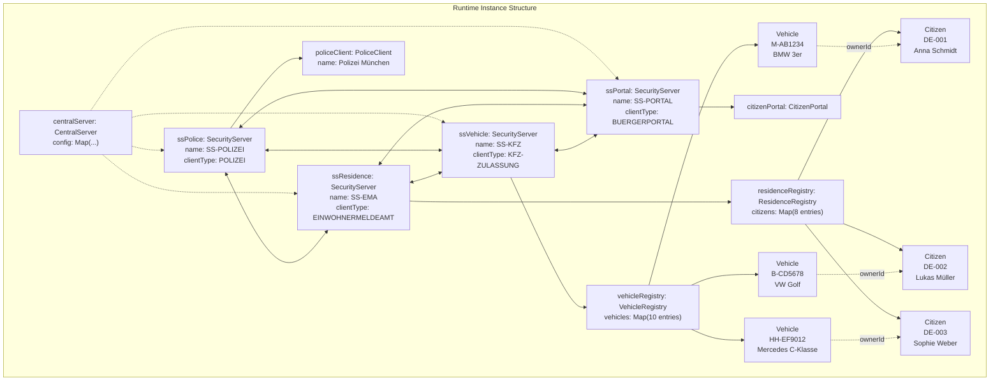

# Klassendiagramm - Once-Only Simulation

## Vollständiges UML-Klassendiagramm

```mermaid
classDiagram
%% ==================== MAIN APPLICATION ====================
    class Main {
        -Option~SimulationContext~ context
        +main(args: Array~String~) void
        -runEventLoop() void
        -withContext(f: SimulationContext) void
        -startSimulation() void
        -restartSimulation() void
        -policeTicketHunt() void
        -showDataTracker() void
        -showStatus() void
    }

    class SimulationContext {
        -Option~CentralServer~ centralServer
        -Option~SecurityServer~ ssPolice
        -Option~SecurityServer~ ssResidence
        -Option~SecurityServer~ ssVehicle
        -Option~SecurityServer~ ssPortal
        -Option~PoliceClient~ policeClient
        -Option~ResidenceRegistry~ residenceRegistry
        -Option~VehicleRegistry~ vehicleRegistry
        -Option~CitizenPortal~ citizenPortal
        +initialize() void
        -initSS(ss: SecurityServer, cs: CentralServer, clientName: String) void
    }

%% ==================== CORE LAYER ====================
    class CentralServer {
        -Map~String, ServiceConfig~ config
        +getConfig(clientType: String) Option~ServiceConfig~
        +findSecurityServer(clientType: String) Option~String~
        +listAllServices() void
    }

    class Constants {
        <<object>>
        +Services Object
        +Clients Object
    }

    note for Constants "Services:\n- GetCitizenData\n- UpdateCitizenData\n- CheckLicensePlate\n- RegisterVehicle\n- GetCitizenVehicles\n- DeregisterVehicle\n- GetVehicleOwner\n\nClients:\n- CitizenPortal\n- VehicleRegistry\n- ResidenceRegistry\n- Police"

    class ServiceConfig {
        +String clientName
        +String securityServerName
        +List~String~ services
    }

    class SecurityServer {
        -String name
        -String clientType
        -CentralServer centralServer
        -Map~String, SecurityServer~ securityServers
        -Option~Client~ client
        -String UnknownId
        -String UnknownPurpose
        -Map~String, Set~String~~ accessControlList
        +registerClient(c: Client) void
        -pullGlobalConfig() void
        +registerPeer(peer: SecurityServer) void
        +sendRequest(recipient: String, service: String, payload: String) Either~String, String~
        +receiveRequest(message: XRoadMessage) Either~String, XRoadMessage~
        -logDataAccess(request: XRoadMessage, response: Option~XRoadMessage~) boolean
    }

    class XRoadMessage {
        +String id
        +MessageType messageType
        +String sender
        +String recipient
        +String service
        +String payload
        +LocalDateTime timestamp
        +createResponse(responsePayload: String) XRoadMessage
    }

    class MessageType {
        <<enumeration>>
        Request
        Response
    }

%% ==================== CLIENT LAYER ====================
    class Client {
        <<abstract>>
        +String name
        +String clientType
        +Option~SecurityServer~ securityServer
        +attachSecurityServer(ss: SecurityServer) void
        +handleRequest(message: XRoadMessage)* XRoadMessage
        #sendServiceRequest(recipient: String, service: String, payload: String) Either~String, String~
    }

    class PoliceClient {
        +String name = "Polizei München"
        +String clientType = Constants.Clients.Police
        -VehicleRegistry vehicleRegistry
        -ResidenceRegistry residenceRegistry
        +processTicket(licensePlate: String) void
        +handleRequest(message: XRoadMessage) XRoadMessage
    }

    class CitizenPortal {
        +String name
        +String clientType
        -ResidenceRegistry residenceRegistry
        +showPortal() void
        -printHeader(citizen: Citizen, text: String) void
        -showCitizenMenu(citizen: Citizen) void
        -changeAddress(citizen: Citizen) void
        -showDataAccess(citizen: Citizen) void
        -registerVehicle(citizen: Citizen) void
        -deregisterVehicle(citizen: Citizen) void
        +handleRequest(message: XRoadMessage) XRoadMessage
    }

    class ResidenceRegistry {
        +String name = "Einwohnermeldeamt München"
        +String clientType = Constants.Clients.ResidenceRegistry
        -Map~String, Citizen~ citizens
        +getCitizen(citizenId: String) Option~Citizen~
        +updateAddress(citizenId: String, newAddress: String) boolean
        -isValidAddress(address: String) boolean
        +handleRequest(message: XRoadMessage) XRoadMessage
        +listAllCitizens() void
    }

    class VehicleRegistry {
        +String name = "KFZ-Zulassungsstelle München"
        +String clientType = Constants.Clients.VehicleRegistry
        -Map~String, Vehicle~ vehicles
        +getVehicleOwner(licensePlate: String) Option~String~
        +handleRequest(message: XRoadMessage) XRoadMessage
        +listAllVehicles() void
    }

%% ==================== DOMAIN LAYER ====================
    class Citizen {
        -String id
        -String firstname
        -String surname
        -String nationality
        -String address
        -String dateOfBirth
        -String placeOfBirth
        +fullName() String
        +birthDetails(): String
    }

    class Vehicle {
        +String licensePlate
        +String citizenId
        +Int vin
        +String brand
        +String model
    }

    class DataAccessLog {
        +String citizenId
        +LocalDateTime timestamp
        +String consumer
        +String provider
        +String dataTransferred
        +String purpose
        -DateTimeFormatter formatter
        +toString() String
    }

    class DataAccessLog_Object {
        <<object>>
        -List~DataAccessLog~ logs
        -String logFile = "logs.json"
        -RW~DataAccessLog~ rw
        -RW~LocalDateTime~ rwDateTime
        +add(log: DataAccessLog) void
        +getLogsForCitizen(citizenId: String) List~DataAccessLog~
        +getAllLogs() List~DataAccessLog~
        -saveLogs() void
        -loadLogs() List~DataAccessLog~
    }

    DataAccessLog_Object ..> DataAccessLog : manages

%% ==================== UI LAYER ====================
    class Terminal {
        <<object>>
        -String RESET
        -String BOLD
        -String RED
        -String GREEN
        -String YELLOW
        -String BLUE
        -String MAGENTA
        -String CYAN
        -String WHITE
        -String BG_RED
        -String BG_GREEN
        -String BG_BLUE
        -String BG_CYAN
        +clearScreen() void
        +printHeader(text: String) void
        +printSubHeader(text: String) void
        +logSuccess(text: String) void
        +logInfo(text: String) void
        +logWarning(text: String) void
        +logError(text: String) void
        +logXRoad(text: String) void
        +printLandingScreen() void
        +printHelp() void
        +printBox(lines: List~String~, color: String) void
        +pressEnter() boolean
        +newLine() void
    }

%% ==================== RELATIONSHIPS ====================

%% === MAIN ORCHESTRATION ===
    Main --> SimulationContext : creates & uses
    SimulationContext --> CentralServer : creates & manages
    SimulationContext --> SecurityServer : creates & wires (4x)
    SimulationContext --> PoliceClient : creates
    SimulationContext --> ResidenceRegistry : creates
    SimulationContext --> VehicleRegistry : creates
    SimulationContext --> CitizenPortal : creates
    SimulationContext ..> Terminal : uses for UI

%% === CORE LAYER ===
    CentralServer *-- ServiceConfig : contains
    SecurityServer --> CentralServer : pulls config from
    SecurityServer o-- SecurityServer : peers with (mesh network)
    SecurityServer --> Client : routes to
    SecurityServer ..> XRoadMessage : sends/receives
    SecurityServer ..> DataAccessLog_Object : logs to
    XRoadMessage --> MessageType : has type

%% === CLIENT INHERITANCE ===
    Client <|-- PoliceClient
    Client <|-- CitizenPortal
    Client <|-- ResidenceRegistry
    Client <|-- VehicleRegistry

%% === CLIENT DEPENDENCIES ===
    Client --> SecurityServer : attached to
    Client ..> XRoadMessage : handles
    PoliceClient --> VehicleRegistry : constructor dependency
    PoliceClient --> ResidenceRegistry : constructor dependency
    CitizenPortal --> ResidenceRegistry : constructor dependency

%% === CLIENT COMMUNICATION (via X-Road) ===
    PoliceClient ..> VehicleRegistry : queries
    PoliceClient ..> ResidenceRegistry : queries
    CitizenPortal ..> VehicleRegistry : queries

%% === DOMAIN MANAGEMENT ===
    ResidenceRegistry o-- Citizen : manages
    VehicleRegistry o-- Vehicle : manages
    Vehicle --> Citizen : references

%% === DATA ACCESS LOGGING ===
    DataAccessLog_Object *-- DataAccessLog : stores
    DataAccessLog --> Citizen : references

%% === UI/LOGGING ===
    PoliceClient ..> Terminal : logs
    CitizenPortal ..> Terminal : logs
    ResidenceRegistry ..> Terminal : logs
    VehicleRegistry ..> Terminal : logs
    SecurityServer ..> Terminal : logs
```

## Komponenten-Übersicht

## Sequenzdiagramm: Strafzettel-Erstellung

## Package-Diagramm

## Datenfluss-Diagramm

## Objektdiagramm: Runtime-Struktur

